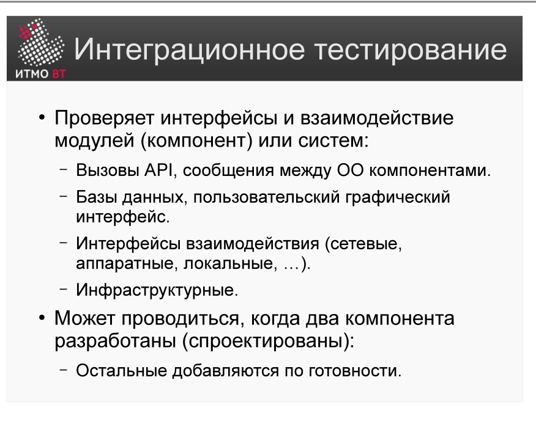
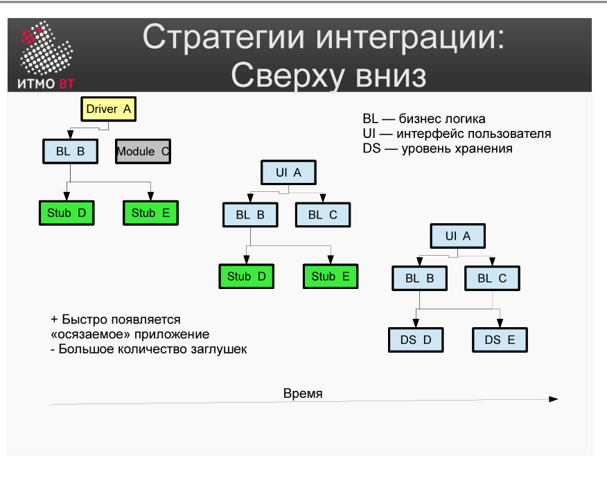
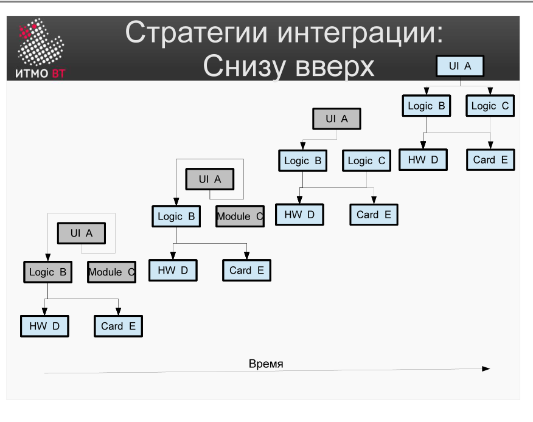

!!! danger "ВНИМАНИЕ"
    Теперь использование данного конспекта является платным. I am Michael from Microsoft support, send 5000$ to my PayPal account

# Билет 60. Интеграционное тестирование. Стратегии интеграции

## Ответ

### Интеграционное тестирование

**Интеграционное тестирование** — тестирование взаимодействия между компонентами системы: интерфейсов, API, протоколов обмена данными.



Проверяет не внутреннюю логику модулей (это юнит-тесты), а **стыки** между ними:
- Корректность форматов данных на границе.
- Правильность обработки ответов и ошибок.
- Соответствие контрактам API.

### Стратегия «сверху вниз» (Top-Down)



Интеграция начинается с **верхнего уровня** (UI или основной модуль). Нижние уровни замещаются **заглушками (stubs)**, которые постепенно заменяются реальными модулями.

```
[Главный модуль]
      ↓
[Модуль A]   [Stub B]   ← B ещё не готов, используем заглушку
      ↓
[Stub A1]               ← A1 тоже заглушка
```

**Плюсы:** рано тестируются архитектурные решения и интерфейс.  
**Минусы:** нижние модули долго остаются заглушками; ошибки нижних уровней выявляются поздно.

### Стратегия «снизу вверх» (Bottom-Up)



Интеграция начинается с **нижнего уровня** (утилиты, драйверы, DAO). Вышестоящие модули замещаются **драйверами (drivers)**.

```
[Driver]               ← временный тестовый драйвер
      ↓
[Модуль DAO]   [Модуль Logger]  ← реальные нижние модули
      ↓
[База данных]
```

**Плюсы:** нижние модули проверены полностью до интеграции с верхом.  
**Минусы:** UI и основная логика тестируются в последнюю очередь.

### Другие стратегии

| Стратегия | Описание |
|-----------|----------|
| **Функциональная** | Интеграция по вертикальным срезам функций (end-to-end одной feature) |
| **Ядро (Backbone)** | Сначала интегрируется «скелет» системы, потом наращивается |
| **Big Bang** | Все модули интегрируются сразу. Простой подход, но сложно найти источник ошибки |

---

## Подробно

### Интерфейсные ошибки — что ищем

- **Неверный формат данных**: модуль ожидает JSON, получает XML.
- **Неверная кодировка**: UTF-8 vs CP1251.
- **Нарушение порядка вызовов**: метод вызван до инициализации.
- **Неверные граничные значения** на стыке: один модуль считает 0 допустимым, другой — нет.
- **Условия гонки**: два потока одновременно модифицируют общий ресурс.

### Когда нужны драйверы и заглушки

**Заглушка (Stub)** — пассивный компонент: возвращает предопределённые данные. Используется в top-down: нижний модуль ещё не написан, заглушка симулирует его ответы.

**Драйвер (Driver)** — активный компонент: вызывает тестируемый модуль. Используется в bottom-up: верхний модуль ещё не написан, драйвер его заменяет.

### Разница: интеграционное vs юнит-тестирование

| Аспект | Юнит | Интеграционное |
|--------|------|----------------|
| Объект | Один метод/класс | Несколько модулей |
| Изоляция | Полная (stubs/mocks) | Частичная или отсутствует |
| Скорость | Быстро (мс) | Медленнее (секунды) |
| Что находит | Логику внутри модуля | Ошибки на стыках |

### Пример: тест интеграции с БД

```java
@Test
public void shouldSaveAndRetrieveUser() {
    // реальная БД (H2 in-memory), без моков
    UserRepository repo = new UserRepository(testDataSource);
    
    User user = new User("alice@test.com");
    repo.save(user);
    
    User found = repo.findByEmail("alice@test.com");
    assertNotNull(found);
    assertEquals("alice@test.com", found.getEmail());
}
```
