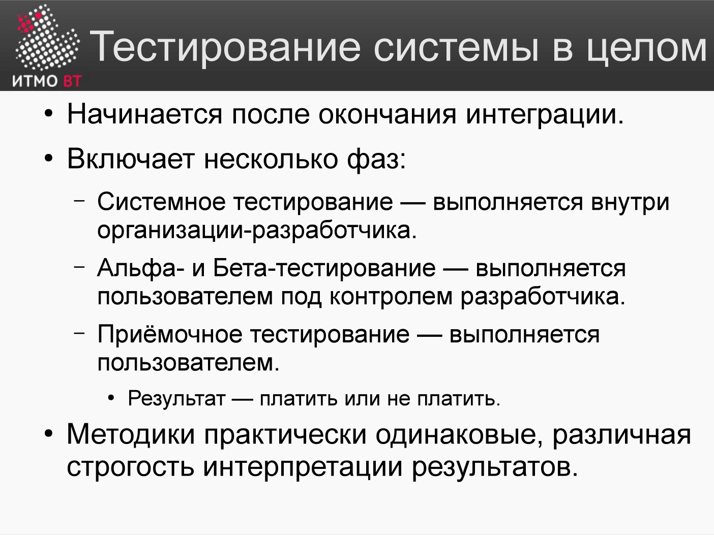

<div style="background:#d32f2f;color:#fff;padding:1.3rem 1.5rem;border-radius:8px;font-size:1.5rem;font-weight:800;line-height:1.35;text-align:center;margin:0 0 1.6rem 0;box-shadow:0 2px 8px rgba(0,0,0,.25)">
Полина Матвеева может не готовиться, всё равно она не сдаст ОПИ завтра.
</div>

# Билет 64. Альфа- и бета-тестирование. Приёмочное тестирование

## Ответ



### Альфа-тестирование

**Альфа-тестирование** — тестирование продукта внутри организации-разработчика, но вне команды разработчиков. Проводится до выпуска продукта наружу.

- **Кто:** сотрудники компании, не разработчики (QA, маркетинг, техподдержка).
- **Где:** в офисе разработчика, под контролем.
- **Цель:** найти дефекты в реалистичных сценариях использования перед показом внешним пользователям.
- **Характеристика:** система ещё нестабильна, часто не все функции реализованы.

### Бета-тестирование

**Бета-тестирование** — тестирование продукта реальными пользователями в реальной среде, до официального выпуска.

- **Кто:** ограниченная группа внешних пользователей (бета-пользователи).
- **Где:** у пользователей, в их окружении.
- **Цель:** получить обратную связь в реальных условиях, выявить проблемы, которые не воспроизвелись в лаборатории.
- **Характеристика:** продукт почти готов, основные баги исправлены.

### Приёмочное тестирование (Acceptance Testing)

**Приёмочное тестирование** — финальная проверка того, что система удовлетворяет требованиям заказчика и готова к передаче.

| Вид | Кто проводит | Цель |
|-----|-------------|------|
| **UAT** (User Acceptance) | Конечные пользователи / заказчик | «Мы получили то, что заказывали?» |
| **BAT** (Business Acceptance) | Бизнес-аналитики заказчика | Соответствие бизнес-процессам |
| **Контрактное приёмочное** | По критериям контракта | Выполнены ли договорные обязательства |

### Последовательность

```
Системное тестирование
        ↓
Альфа-тестирование (внутри компании)
        ↓
Бета-тестирование (внешние пользователи)
        ↓
Приёмочное тестирование (заказчик)
        ↓
Выпуск (Release)
```

---

## Подробно

### Почему нельзя пропустить альфа- и бета-фазы

**Альфа:** разработчики «слепы» к собственному продукту. Они знают, как он устроен, и интуитивно обходят неудобные места. Человек из другого отдела, видящий продукт впервые, найдёт проблемы в usability, которые разработчик не замечал.

**Бета:** тестирование в лаборатории не воспроизводит реальное окружение пользователя. У пользователя может быть старый браузер, плохой интернет, нестандартная раскладка клавиатуры, данные в кириллице. Только реальные условия выявляют такие проблемы.

### UAT vs системное тестирование

| Аспект | Системное | UAT |
|--------|-----------|-----|
| Кто | QA-команда | Заказчик/пользователи |
| По чему | Технические требования | Бизнес-требования, реальные сценарии |
| Фокус | «Система работает» | «Я могу делать свою работу» |
| Формат | Тест-кейсы | Бизнес-сценарии |

### Критерии приёмки (Acceptance Criteria)

Приёмочные критерии должны быть зафиксированы **до** начала разработки. Иначе заказчик может принять систему с одним набором требований, а потом заявить, что «это не то».

Формат: «Система принята, если:
- все задокументированные Use-case выполняются без ошибок,
- время ответа на поиск < 3 секунд,
- пройдено не менее 90% приёмочных тест-кейсов».

### Smoke Test (курение)

Перед началом бета/приёмочного тестирования проводят **smoke test** — базовую проверку, что система запускается и ключевые функции работают. Если smoke test упал — возвращают разработчикам, не тратя время на детальное тестирование сломанной системы.
