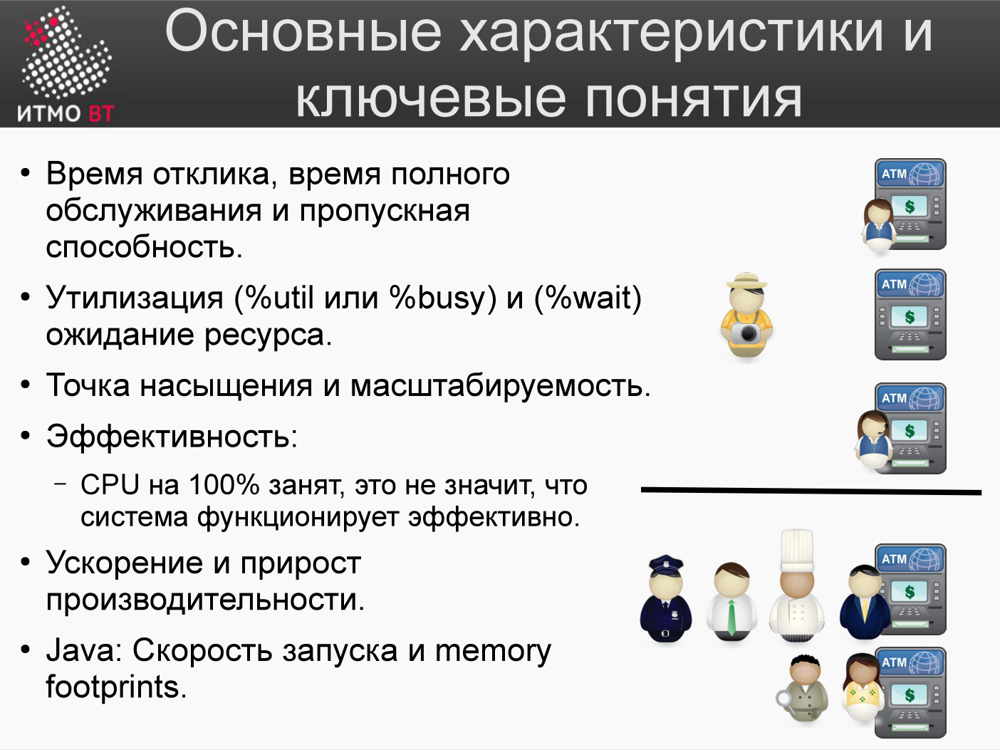
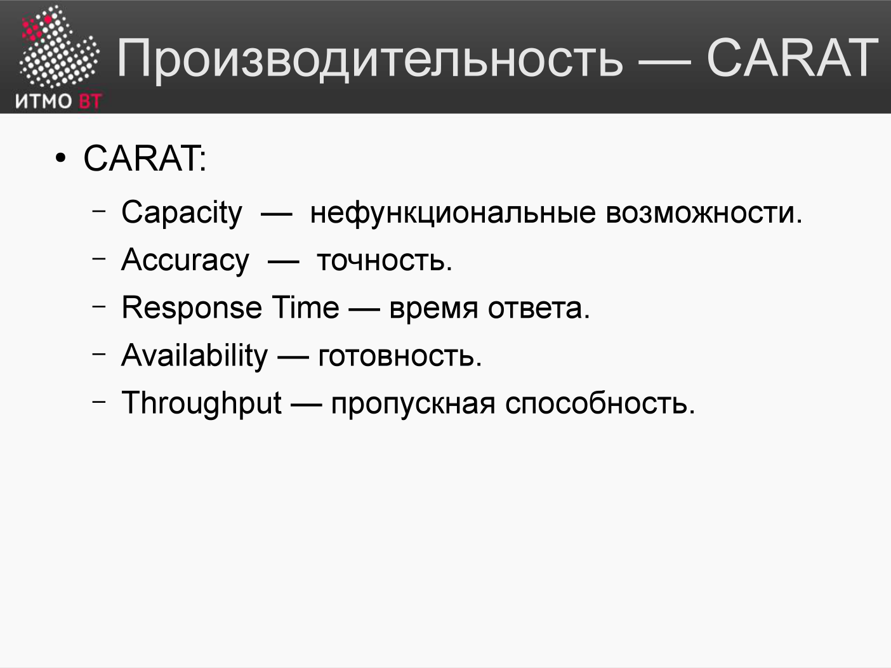

# Билет 66. Ключевые характеристики производительности

## Ответ

### Ключевые понятия (по лекции)



| Характеристика | Что показывает |
|----------------|----------------|
| **Время отклика** (latency) | Время от выдачи запроса до получения **первых** результатов (у банкомата — от ввода карты до первой порции денег) |
| **Время полного обслуживания** | Время до получения полного результата (вся запрошенная сумма) |
| **Пропускная способность** (throughput) | Максимальное число запросов за единицу времени через канал, систему или её узел |
| **Утилизация** (%util / %busy) | Доля времени, когда ресурс занят полезной работой (банкомат занят 9 из 10 минут → утилизация 90%) |
| **Ожидание ресурса** (%wait) | Доля времени, когда очередь к ресурсу **не пуста** (учитывает среднюю длину очереди) |
| **Точка насыщения** | Момент, когда нагрузка достигает предела и система не может обработать больше. После неё производительность падает (резко — компоненты несбалансированы; плавно — сбалансированы) |
| **Масштабируемость** | Насколько можно количественно расширить и нагрузить систему |
| **Эффективность** | Отношение полезной работы к общему объёму работы. **CPU на 100% занят ≠ система работает эффективно** (например, своп тратит CPU и диск впустую) |
| **Ускорение и прирост производительности** | Насколько больше полезной работы выполняет программа после внесения изменений |
| **Memory footprints (Java)** | Стратегии использования памяти и скорость запуска; при некорректной работе с памятью скорость резко падает |

Математически точные определения этих параметров даёт теория массового обслуживания.

### CARAT — мнемоника характеристик



Лекция сводит ключевые характеристики производительности в аббревиатуру **CARAT**:

- **C**apacity — ёмкость (нефункциональные возможности);
- **A**ccuracy — точность;
- **R**esponse time — время ответа;
- **A**vailability — готовность;
- **T**hroughput — пропускная способность.

---

Ниже — как эти характеристики проявляются на уровне конкретных ресурсов: CPU, память, I/O, сеть.

### CPU

```
%user   — время выполнения кода приложения
%sys    — время выполнения кода ядра (системные вызовы)
%iowait — CPU простаивает, ожидая завершения I/O
%idle   — CPU не занят (нет работы)

Итого: %user + %sys + %iowait + %idle = 100%
```

**Диагностика по значению:**
- Высокий **%user** → узкое место в коде приложения.
- Высокий **%sys** → много системных вызовов (I/O, сеть, межпроцессное взаимодействие).
- Высокий **%iowait** → ожидание диска или сети.
- Высокий **%idle** → система недогружена или заблокирована на внешнем ресурсе.

### Память

| Метрика | Что показывает |
|---------|----------------|
| **Физическая RAM (used/free)** | Сколько реальной памяти занято |
| **Swap used** | Сколько данных вытеснено на диск |
| **Page faults (minor)** | Страница в памяти, но не в кэше процесса |
| **Page faults (major)** | Страница загружена с диска — медленно |
| **Cache/Buffers** | Память, используемая под кэш файловой системы |

Высокий swap → система использует диск как RAM → резкое замедление.

### Диск (I/O)

| Метрика | Что показывает |
|---------|----------------|
| **IOPS** | Число операций ввода-вывода в секунду |
| **Throughput** (МБ/с) | Объём данных в секунду |
| **Latency** (мс) | Время одной операции |
| **%util** | Доля времени, когда устройство занято |
| **await** | Среднее время ожидания I/O-запроса |

HDD: ~100–200 IOPS. SSD: 10 000–500 000 IOPS. NVMe: 1 000 000+ IOPS.

### Сеть

| Метрика | Что показывает |
|---------|----------------|
| **Bandwidth** (Мбит/с) | Пропускная способность канала |
| **Packets/sec** | Число пакетов в секунду |
| **Errors/Dropped** | Потерянные пакеты |
| **Latency (ping)** | Задержка туда-обратно |
| **Connections** | Число открытых TCP-соединений |

### Load Average

```
load average: 1.5, 2.3, 1.8
              ↑      ↑    ↑
           1 мин  5 мин  15 мин
```

Показывает среднее число задач, ожидающих выполнения. На N-ядерной системе значение ≤ N означает, что CPU справляется.

---

## Подробно

### Как читать `top` / `htop`

```
top - 14:32:01 up 5 days, load average: 0.85, 0.92, 0.88
Tasks: 210 total, 1 running, 209 sleeping
%Cpu(s):  25.0 us,  5.0 sy,  0.0 ni, 68.0 id,  2.0 wa,  0.0 hi
MiB Mem : 15892.3 total,  1023.4 free,  8234.1 used,  6634.8 buff/cache
MiB Swap:  2048.0 total,  1800.0 free,   248.0 used.
```

- `us` = %user, `sy` = %sys, `id` = %idle, `wa` = %iowait.
- `buff/cache` — это **не** занятая память: ядро отдаст её приложениям при необходимости.
- Swap used 248 МБ: сигнал, что памяти не хватает — часть данных на диске.

### Перцентили latency — правильная метрика

Среднее время ответа скрывает «хвосты». Стандартная практика:
- **P50** (медиана) — типичный пользователь.
- **P95** — медленный пользователь.
- **P99** — очень медленный запрос.
- **P99.9** (three nines) — единицы из тысяч.

SLA обычно формулируется как P95 или P99: «99% запросов обрабатываются за < 200 мс».

### Закон Литтла (Little's Law)

$$L = \lambda \times W$$

где:
- $L$ — среднее число запросов в системе,
- $\lambda$ — пропускная способность (запросов/сек),
- $W$ — среднее время обработки запроса.

Если нужно обработать 100 RPS, и каждый запрос занимает 0.5 с, то в системе одновременно находится 50 запросов. Это количество нужных worker-потоков.
