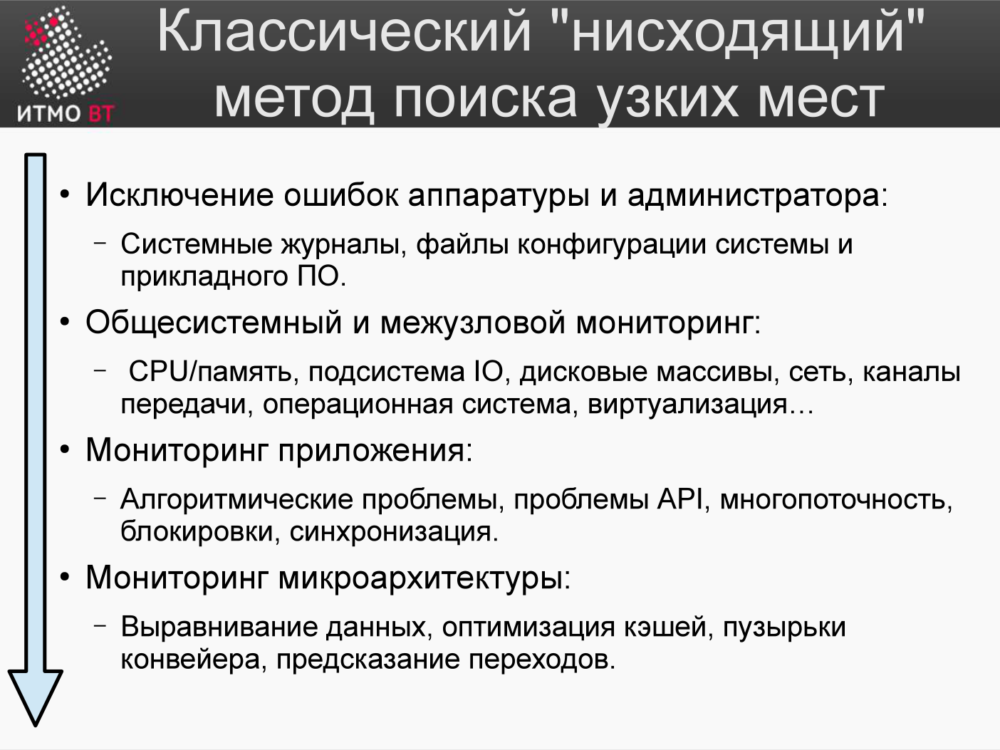

# Билет 67. Нисходящий метод поиска узких мест

## Ответ

**Нисходящий (top-down) метод** — подход к анализу производительности, при котором систему последовательно рассматривают от более общих компонент к более частным, углубляясь до конкретного узкого места.

### Четыре уровня (по лекции)



```
1. Исключение ошибок аппаратуры и администратора
       (системные журналы, файлы конфигурации системы и прикладного ПО)
    ↓
2. Общесистемный и межузловой мониторинг
       (CPU/память, подсистема I/O, дисковые массивы, сеть,
        каналы передачи, ОС, виртуализация)
    ↓
3. Мониторинг приложения
       (алгоритмические проблемы, проблемы API,
        многопоточность, блокировки, синхронизация)
    ↓
4. Мониторинг микроархитектуры
       (выравнивание данных, оптимизация кэшей,
        пузырьки конвейера, предсказание переходов)
```

- **Уровень 1.** Сначала администратор ищет ошибки аппаратуры и конфигурации: сбойный блок на диске или дефект кабеля вызывают повторное чтение → снижают скорость I/O. В журналах такие ошибки видны сразу. Сюда же — ошибки администратора (например, мало памяти под JVM → частые сборки мусора).
- **Уровень 2.** После исключения ошибок начинается наблюдение средствами ОС, межузлового мониторинга и мониторинга виртуальных машин — общая картина работы приложения.
- **Уровень 3.** Наблюдение за самим приложением средствами мониторинга и профилирования: алгоритмы, API, многопоточность, блокировки.
- **Уровень 4.** Если прироста недостаточно — переход к микроархитектуре. Здесь нужно знать ассемблер, архитектуру процессора и принципы компиляции. В пользовательском ПО до этого уровня обычно **не доходят** из-за сложности внесения изменений.

### Принцип

Не начинать с профилировщика кода сразу. Сначала исключить ошибки и выяснить, какой ресурс — узкое место, и только потом углубляться.

### Шаги

**Шаг 1: Наблюдение на уровне системы**

```bash
uptime          # load average — есть ли очередь?
top             # %CPU, %MEM по процессам
vmstat 1        # CPU/memory/I/O в динамике
iostat -xz 1   # загрузка дисков
netstat -s      # статистика сети
```

**Шаг 2: Определение ресурса-узкого места**

```
%user высокий?   → приложение грузит CPU
%iowait высокий? → ждём диск или сеть
swap активен?    → не хватает RAM
await диска > 10мс? → диск — узкое место
```

**Шаг 3: Определение процесса**

```bash
top             # по %CPU или %MEM
pidstat 1       # CPU/I/O по процессам
iotop           # I/O по процессам
```

**Шаг 4: Углубление в приложение**

```bash
strace -p PID   # системные вызовы процесса
perf top -p PID # горячие функции
jstack PID      # стек потоков Java
```

**Шаг 5: Анализ кода**

Профилировщик (sampling): найти функции, потребляющие максимум CPU или время.

### Почему нисходящий, а не восходящий

Начать сразу с профилировщика кода — значит оптимизировать код, который ждёт диска. CPU-профиль покажет «ждать в системном вызове read()», но не скажет, что диск перегружен. Нисходящий метод исключает ложные направления.

---

## Подробно

### vmstat — главный инструмент первого уровня

```bash
vmstat 1
procs -----------memory---------- ---swap-- -----io---- -system-- ------cpu-----
 r  b   swpd   free   buff  cache   si   so    bi    bo   in   cs us sy id wa st
 2  1  49152 102400  20480 819200    5   0   500  100  800 2000 25  5 65  5  0
```

- `r` = число процессов, ожидающих CPU (run queue)
- `b` = число процессов, ожидающих I/O (blocked)
- `si/so` = swap in/out (есть подкачка!)
- `bi/bo` = блоки I/O в/из диска
- `cs` = переключения контекста (высокое → много потоков)

### Граф пламени (Flame Graph)

Популярный способ визуализации результатов sampling profiler:

```
Ось X = время CPU (чем шире полоска, тем больше CPU)
Ось Y = глубина стека (нижние вызывают верхние)
```

Самые широкие «башни» сверху — горячие функции. Инструмент: Brendan Gregg's FlameGraph + `perf` (Linux) или `async-profiler` (Java).

### Правило 80/20 в производительности

В большинстве систем 80% времени выполнения тратится в 20% кода. Задача профилирования — найти эти 20% и оптимизировать их. Оптимизация остальных 80% даёт минимальный эффект.

### Ловушка преждевременной оптимизации

«Преждевременная оптимизация — корень всех зол» (Donald Knuth). Не оптимизировать код, пока не доказано измерениями, что именно он — узкое место. Читаемый код с медленным алгоритмом лучше поддаётся последующей оптимизации, чем нечитаемый «оптимизированный» код.
