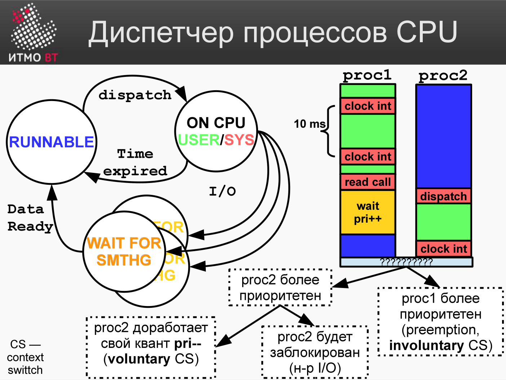

# Билет 69. Мониторинг производительности: процессы

## Ответ

### Состояния процесса



```
Создан
  ↓
Готов (Ready) ←────────────────┐
  ↓                             │
Выполняется (Running)          │
  ↓            ↓               │
Завершён    Заблокирован  ──→ Готов
            (Blocked/Sleep)
```

| Состояние | Символ (top/ps) | Причина |
|-----------|-----------------|---------|
| Running | R | Выполняется или ожидает CPU в очереди |
| Sleeping | S | Ждёт события (I/O, таймер, сигнал) |
| Uninterruptible sleep | D | Ждёт I/O, нельзя прервать |
| Zombie | Z | Завершился, но родитель не считал код возврата |
| Stopped | T | Приостановлен (Ctrl+Z) |

**D-состояние** — признак проблем с I/O: диск завис или NFS-сервер недоступен.

### Основные команды

```bash
ps aux           # список всех процессов
ps aux --sort=-%cpu | head   # топ по CPU
ps aux --sort=-%mem | head   # топ по памяти

top              # интерактивный мониторинг
htop             # улучшенный top

pidstat 1        # CPU/IO по PID, каждую секунду
pidstat -d 1     # I/O активность процессов
```

### Load Average

```
load average: 0.85, 1.23, 0.92
              ↑      ↑      ↑
           1 мин  5 мин  15 мин
```

На 4-ядерном CPU:
- load < 4 → CPU справляется.
- load = 4 → CPU полностью загружен.
- load > 4 → задачи ждут в очереди.

Растущий тренд (15 мин > 5 мин > 1 мин) = нагрузка увеличивается.

### uptime + who + w

```bash
uptime   # время работы системы и load average
w        # кто залогинен + load average + их процессы
```

---

## Подробно

### /proc — источник всей информации

В Linux информация о процессах живёт в виртуальной файловой системе `/proc`:

```bash
cat /proc/PID/status        # статус процесса: VmRSS, State, Threads
cat /proc/PID/cmdline       # командная строка запуска
cat /proc/PID/fd/ | wc -l  # число открытых файловых дескрипторов
cat /proc/PID/maps          # карта виртуальной памяти
cat /proc/loadavg            # load average
cat /proc/meminfo            # информация о памяти
```

Все инструменты (`top`, `ps`, `htop`) читают `/proc`.

### Zombie-процессы

Zombie не потребляет CPU и память (только PID и запись в таблице процессов). Проблема возникает, если зомби тысячи: таблица PID заполняется, новые процессы не создаются. Причина: родительский процесс не вызвал `wait()`. Решение: перезапустить родительский процесс.

### OOM Killer

Когда RAM + swap исчерпаны, ядро Linux запускает **OOM Killer** (Out-of-Memory Killer): выбирает процесс с высоким `oom_score` и завершает его принудительно.

```bash
dmesg | grep -i "killed process"   # был ли OOM kill?
cat /proc/PID/oom_score           # оценка кандидата на убийство
```

Если сервис неожиданно завершается — первое, что проверяют.

### Мониторинг числа потоков

```bash
ps -eLf | grep java | wc -l   # число потоков Java-процесса
cat /proc/PID/status | grep Threads
```

Резкий рост числа потоков → thread leak (утечка потоков): что-то создаёт потоки, но не завершает их.

### pstree и lsof

```bash
pstree -p PID    # дерево дочерних процессов
lsof -p PID      # все открытые файлы, сокеты, дескрипторы
lsof -i :8080    # какой процесс слушает порт 8080
```
