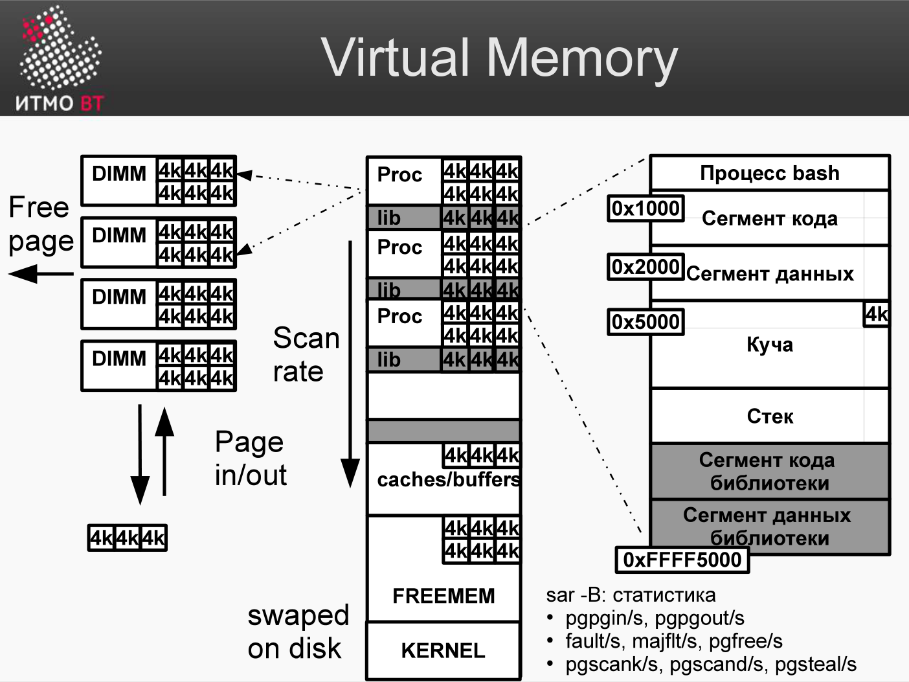

# Билет 70. Мониторинг производительности: виртуальная память

## Ответ

### Виртуальная память



**Виртуальная память** — механизм ОС, при котором каждый процесс видит собственное изолированное адресное пространство. ОС транслирует виртуальные адреса в физические через **page table**.

```
Процесс A           Физическая RAM
[0x0000–0x0FFF] →  [RAM страница 5]
[0x1000–0x1FFF] →  [RAM страница 12]
[0x2000–0x2FFF] →  [Swap на диске]  ← страница вытеснена
```

### Swap

**Swap** — раздел или файл на диске, куда ядро вытесняет «холодные» страницы памяти при нехватке RAM.

Доступ к вытесненной странице (major page fault) = загрузка с диска = сотни микросекунд vs ~100 нс для RAM.

**Признаки проблем с памятью:**

```bash
free -m
              total  used  free  shared  buff/cache  available
Mem:          15892  8234  1023     512        6634       6900
Swap:          2048   512  1536

# Swap used = 512 МБ → ядро вытесняет страницы
```

### Команды мониторинга

```bash
free -m              # RAM и swap (МБ)
vmstat 1             # si/so = swap in/out
cat /proc/meminfo    # детальная информация
```

### vmstat: ключевые поля памяти

```
procs -----------memory---------- ---swap--
 r  b   swpd   free   buff  cache   si   so
 1  0  49152 102400  20480 819200    5   15

swpd  — использованный swap (байты)
free  — свободная RAM
buff  — буферы ядра (метаданные ФС)
cache — дисковый кэш (page cache)
si    — страниц прочитано из swap/сек
so    — страниц записано в swap/сек
```

`si > 0` или `so > 0` → система активно свопит → нехватка RAM.

### Page fault

**Minor page fault** — страница в RAM, но не в TLB или рабочем наборе процесса → быстро, ядро просто обновляет mapping.

**Major page fault** — страница на диске (в swap или файле) → загрузка → медленно.

```bash
pidstat -r 1   # page faults по процессу
               # minflt/s = minor, majflt/s = major
```

---

## Подробно

### Анатомия /proc/meminfo

```bash
MemTotal:     16284236 kB  — всего RAM
MemFree:        104544 kB  — не занято вообще
MemAvailable:  6891572 kB  — доступно для приложений (free + освобождаемый кэш)
Buffers:         20960 kB  — метаданные ФС
Cached:         838864 kB  — page cache (данные файлов)
SwapCached:      12288 kB  — в swap, но ещё не удалено из RAM
SwapTotal:     2097148 kB  — размер swap
SwapFree:      1572864 kB  — свободный swap
```

**MemAvailable** — правильная метрика «доступной» памяти. `MemFree` занижает: `Cached` тоже отдаётся приложениям.

### OOM Score

ОС вычисляет `oom_score` (0–1000) для каждого процесса: чем выше, тем больше шансов быть убитым OOM Killer.

```bash
cat /proc/$(pgrep java)/oom_score       # текущая оценка
echo -500 > /proc/$(pgrep java)/oom_score_adj  # снизить приоритет убийства
```

### Huge Pages

Стандартная страница памяти в Linux — 4 КБ. При 16 ГБ RAM это 4 млн записей в page table. TLB маленький (64–2048 записей), промахи часты.

**Huge pages (2 МБ):** те же 16 ГБ = 8192 страниц → меньше TLB-промахов → быстрее для баз данных, JVM.

```bash
grep HugePages /proc/meminfo
HugePages_Total:   512   # зарезервировано huge pages
HugePages_Free:    200   # свободных
```

### NUMA (Non-Uniform Memory Access)

На многопроцессорных серверах у каждого CPU своя локальная RAM. Доступ к «чужой» RAM (remote) медленнее на 30–40%.

```bash
numactl --hardware   # топология NUMA
numastat             # статистика попаданий/промахов NUMA
```

Неправильное размещение потоков процесса → постоянно работают с «чужой» памятью → скрытое снижение производительности.
