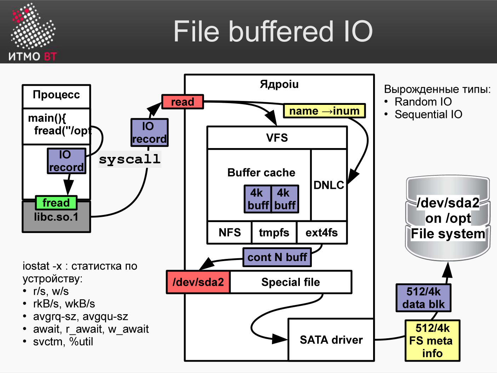

<div style="background:#d32f2f;color:#fff;padding:1.3rem 1.5rem;border-radius:8px;font-size:1.5rem;font-weight:800;line-height:1.35;text-align:center;margin:0 0 1.6rem 0;box-shadow:0 2px 8px rgba(0,0,0,.25)">
Полина Матвеева может не готовиться, всё равно она не сдаст ОПИ завтра.
</div>

# Билет 71. Мониторинг производительности: буферизированный файловый ввод-вывод

## Ответ

### Буферизированный файловый I/O



При стандартных файловых операциях (`read()`/`write()`) данные не идут напрямую на диск. Ядро использует **page cache** (кэш страниц) — область RAM, хранящая копии блоков диска.

```
Приложение
    ↓  write()
Page Cache (RAM)  ← данные попадают сюда (быстро)
    ↓  (асинхронно, через некоторое время)
Диск              ← реальная запись (медленно)
```

**Чтение:** если блок в page cache → возврат из RAM (быстро). Иначе — загрузка с диска в cache, затем возврат.

**Запись:** данные записываются в page cache («грязные страницы»), ядро сбрасывает их на диск периодически (dirty writeback) или по явному `fsync()`.

### Преимущества и риски

| Аспект | Буферизированный I/O | Direct I/O (O_DIRECT) |
|--------|---------------------|----------------------|
| Скорость чтения | Быстро (кэш в RAM) | Медленнее (всегда с диска) |
| Скорость записи | Быстро (в RAM) | Медленнее (сразу на диск) |
| Потеря при сбое | Возможна (dirty pages) | Нет |
| Использование RAM | Занимает page cache | Нет |

### Команды мониторинга I/O

```bash
iostat -xz 1      # статистика дисков каждую секунду
iotop             # I/O по процессам (как top для диска)
pidstat -d 1      # I/O по PID

vmstat 1          # bi/bo = блоки in/out
```

### iostat: ключевые поля

```
Device   r/s  w/s  rkB/s  wkB/s  await  %util
sda      10   50   400    2000   8.5    45
nvme0n1  500  200  20000  8000   0.3    20

r/s, w/s     — операций чтения/записи в секунду (IOPS)
rkB/s, wkB/s — КБ/с чтения/записи (пропускная способность)
await        — среднее время ожидания I/O (мс)
%util        — процент времени, когда устройство занято
```

`%util = 100%` → диск полностью загружен → I/O bottleneck.  
`await > 20мс` для SSD → проблема.  
`await > 100мс` для HDD → перегружен.

---

## Подробно

### Page Cache подробно

```bash
cat /proc/meminfo | grep -E "Cached|Dirty|Writeback"
Cached:          838864 kB   — page cache (файловые данные)
Dirty:             12288 kB  — «грязные» страницы (не сброшены на диск)
Writeback:          2048 kB  — прямо сейчас записываются на диск
```

Если `Dirty` большой (сотни МБ) → много данных ждёт записи → при сбое питания потеряются.

### fsync() vs sync()

```c
fsync(fd);   // сбросить данные конкретного файла на диск
sync();      // сбросить все dirty pages (медленно)
```

БД (PostgreSQL, MySQL) вызывают `fsync()` явно при коммите транзакции — гарантия долговечности (Durability в ACID). Это главная причина, почему IOPS диска важен для БД.

### Параметры writeback

```bash
sysctl vm.dirty_ratio          # % RAM под dirty pages (по умолчанию 20%)
sysctl vm.dirty_background_ratio  # % для фонового writeback (по умолчанию 10%)
sysctl vm.dirty_writeback_centisecs  # интервал writeback (500 = 5 сек)
```

На серверах БД `dirty_ratio` уменьшают до 5%: меньше риск потери данных при сбое.

### Читать vs. Записывать: разные паттерны

**Sequential read** (последовательное чтение): видео, бэкап — максимальная пропускная способность, одна большая очередь I/O. HDD справляется хорошо.

**Random read** (случайное чтение): БД — маленькие блоки, произвольные позиции. HDD: ~150 IOPS (нужно позиционировать головку). SSD: 100 000+ IOPS.

**Смешанный workload:** одновременно много random write + read → читателям придётся ждать, пока очередь записи выполнится.

### Direct I/O (O_DIRECT)

БД (Oracle, PostgreSQL) умеют работать в режиме O_DIRECT: обходят page cache и работают с диском напрямую. Зачем? БД имеют собственный кэш (buffer pool), который умнее generic page cache. Двойное кэширование только тратит RAM.
