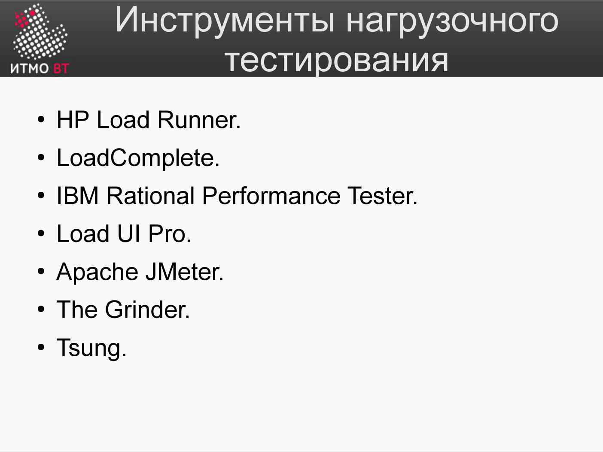

<div style="background:#d32f2f;color:#fff;padding:1.3rem 1.5rem;border-radius:8px;font-size:1.5rem;font-weight:800;line-height:1.35;text-align:center;margin:0 0 1.6rem 0;box-shadow:0 2px 8px rgba(0,0,0,.25)">
Полина Матвеева может не готовиться, всё равно она не сдаст ОПИ завтра.
</div>

# Билет 74. Создание тестовой нагрузки и нагрузчики

## Ответ

### Зачем создавать тестовую нагрузку

Нагрузочное тестирование отвечает на вопросы:
- Сколько пользователей выдержит система?
- Как деградирует время ответа при росте нагрузки?
- Где находится предел производительности?
- Нет ли утечек памяти при длительной нагрузке?

### Виды нагрузки

```
Throughput
  ↑
  │                   ●● (plateau)
  │              ●●●●●
  │          ●●●●
  │      ●●●●
  │  ●●●●
  └──────────────────── Число пользователей

Load test:  плавное нарастание до целевого уровня
Stress test: превышение целевого, поиск предела
Spike test:  резкий всплеск (атака «флэш-моб»)
Soak test:   длительная нагрузка (часы, дни)
```

### Популярные нагрузчики



| Инструмент | Язык сценариев | Особенности |
|-----------|----------------|-------------|
| **Apache JMeter** | XML (GUI) + Groovy | Desktop GUI, богатые плагины, HTTP/JDBC/FTP |
| **Gatling** | Scala DSL | Высокая нагрузка (100k+ RPS), красивые отчёты |
| **k6** | JavaScript | Лёгкий, DevOps-friendly, CLI, Grafana Cloud |
| **Locust** | Python | Простой, сценарии — обычный Python-код |
| **Apache Bench (ab)** | CLI | Встроен в Apache, только HTTP, простые случаи |
| **wrk** / **wrk2** | Lua (опционально) | Высокопроизводительный, minimal overhead |

### JMeter: структура теста

```
Test Plan
  └─ Thread Group (виртуальных пользователей: 100, ramp-up: 60 сек)
       ├─ HTTP Request Defaults (базовый URL)
       ├─ HTTP Request: GET /api/products
       ├─ HTTP Request: POST /api/orders
       ├─ Think Time: 1–3 сек (имитация пользователя)
       └─ Listener: Summary Report / Aggregate Report
```

### k6: пример сценария

```javascript
import http from 'k6/http';
import { sleep, check } from 'k6';

export let options = {
    vus: 100,          // виртуальных пользователей
    duration: '60s',   // длительность
};

export default function () {
    let res = http.get('http://api.example.com/products');
    check(res, {
        'status 200': (r) => r.status === 200,
        'response < 500ms': (r) => r.timings.duration < 500,
    });
    sleep(1);
}
```

---

## Подробно

### Что измерять

Для каждого теста собирать:
- **Время ответа** (P50, P95, P99)
- **Throughput** (RPS — requests per second)
- **Error rate** (% ошибок 4xx/5xx)
- **Системные ресурсы** (CPU, RAM, I/O, сеть) на сервере

Без метрик сервера нагрузочный тест даёт лишь «симптомы», без причин.

### Warmup period

Первые 1–2 минуты нагрузочного теста не учитываются в результатах: JIT-компилятор «разогревается», кэши заполняются. Реальные цифры — после установления стабильного режима.

### Think Time — имитация реального пользователя

Реальный пользователь не отправляет запросы с максимальной скоростью. Между действиями — паузы (чтение страницы, заполнение формы). `sleep(1–3 сек)` в сценарии делает нагрузку реалистичной.

Без think time 100 виртуальных пользователей генерируют столько же запросов, сколько 10 000 реальных.

### Корреляция динамических данных

Проблема: сервер возвращает уникальный токен (CSRF, session ID), который нужно передать в следующем запросе. Нагрузчик должен его «поймать» и подставить.

В JMeter: `Regular Expression Extractor` извлекает значение из ответа → переменная → используется в следующем запросе.

В k6:
```javascript
let res = http.post('/login', { user: 'test', pass: 'test' });
let token = res.json('token');
http.get('/profile', { headers: { Authorization: `Bearer ${token}` } });
```

### Распределённая нагрузка

Один нагрузчик ограничен CPU и сетью своей машины. Для высокой нагрузки (10 000+ RPS) используют несколько агентов:
- JMeter: master + несколько remote slaves.
- k6: k6 Cloud или несколько экземпляров с агрегацией.
- Gatling Enterprise: встроенная поддержка кластера.
