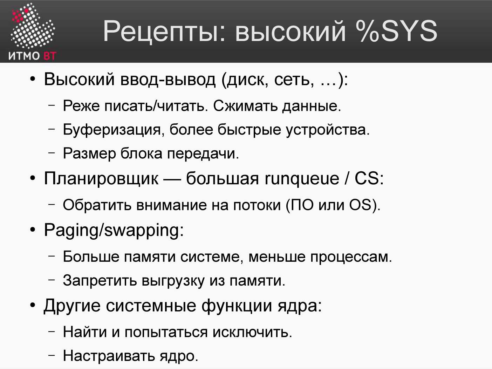

# Билет 77. Рецепты повышения производительности при высоком %SYS

## Ответ

**%SYS (kernel time)** — доля процессорного времени, затраченная на выполнение кода ядра операционной системы.

Высокий %SYS означает, что приложение часто переключается в режим ядра — делает много системных вызовов.



### Диагностика

```bash
# Подтвердить высокий %SYS
vmstat 1    # смотреть колонку sy
mpstat 1    # sy по каждому ядру

# Найти источник: какие системные вызовы?
strace -c -p PID     # статистика syscalls (overhead!)
perf stat -p PID     # быстро, без strace overhead
```

### Типичные причины и рецепты

| Причина | Симптом | Рецепт |
|---------|---------|--------|
| **Много мелких I/O операций** | Тысячи read()/write() | Буферизация, увеличить размер буфера |
| **Много мелких сетевых пакетов** | Тысячи send()/recv() | Алгоритм Нагля (TCP_NODELAY OFF), батчинг |
| **Много потоков / переключений контекста** | `cs` в vmstat высокое | Уменьшить число потоков, thread pool |
| **Много системных выделений памяти** | Тысячи mmap()/brk() | Пул объектов, уменьшить GC давление |
| **Частые сигналы/таймеры** | — | Уменьшить частоту, объединить таймеры |
| **Много открытий/закрытий файлов** | Тысячи open()/close() | Пул соединений, кэшировать дескрипторы |

### Рецепт 1: Буферизация I/O

```java
// Плохо: запись по байту = тысячи write() syscalls
FileOutputStream fos = new FileOutputStream("file.txt");
for (byte b : data) fos.write(b);

// Хорошо: буферизованная запись = один-несколько write()
BufferedOutputStream bos = new BufferedOutputStream(fos, 65536);
bos.write(data);
bos.flush();
```

### Рецепт 2: Уменьшение числа потоков

```
Проблема: 10 000 потоков = 10 000 переключений контекста/сек
Решение:  thread pool с N потоками (N = 2× количество ядер)
          + асинхронный I/O (NIO, epoll)
```

### Рецепт 3: Пул соединений (для БД/HTTP)

Каждое новое соединение = syscalls (socket, connect, handshake). Пул создаёт соединения заранее и переиспользует:

```java
// HikariCP — пул соединений к БД
HikariConfig config = new HikariConfig();
config.setMaximumPoolSize(20);  // 20 соединений на все потоки
DataSource ds = new HikariDataSource(config);
```

---

## Подробно

### Переключение контекста (context switch)

При переключении контекста ядро сохраняет регистры CPU текущего потока и загружает регистры следующего. Это дорого: ~1–10 мкс, плюс сброс кэша TLB.

```bash
vmstat 1
 r  b   swpd   free   buff  cache   si   so    bi    bo   in    cs  us sy id wa
 1  0      0 102400  20480 819200    0    0   500   100  800 15000  20 25 55  0
                                                              ↑
                                           15 000 переключений контекста/сек — высоко
```

Нормально: 1 000–5 000 cs/сек на нагруженном сервере. 50 000+ cs/сек — проблема.

### TCP_CORK и батчинг сетевых пакетов

При отправке множества мелких данных алгоритм Нагля объединяет их в один TCP-пакет. Для интерактивных протоколов (SSH, игры) это плохо — включают `TCP_NODELAY`. Для серверных приложений, наоборот, батчинг выгоден.

```c
// Отключить алгоритм Нагля (отправлять сразу)
int flag = 1;
setsockopt(sock, IPPROTO_TCP, TCP_NODELAY, &flag, sizeof(flag));

// Явный батчинг
setsockopt(sock, IPPROTO_TCP, TCP_CORK, &flag, sizeof(flag));
// ... записать несколько частей ...
flag = 0;
setsockopt(sock, IPPROTO_TCP, TCP_CORK, &flag, sizeof(flag)); // отправить
```

### Zero-copy

Стандартная передача файла по сети:
```
Диск → RAM (буфер ядра) → RAM (буфер пользователя) → RAM (буфер ядра) → Сеть
```
4 копии, 2 системных вызова.

`sendfile()` — zero-copy:
```
Диск → RAM (буфер ядра) → Сеть
```
2 копии, 1 системный вызов. Nginx, Kafka используют sendfile для отдачи файлов.

### perf stat — быстрая статистика без strace

```bash
perf stat -p PID sleep 5

 Performance counter stats:
 157 234 915  cpu-cycles
  98 234 567  instructions            # 0.62 insn/cycle — низкая эффективность
  34 523 145  cache-misses
   8 234 567  context-switches        # 1.6 млн в секунду — высоко
     123 456  page-faults
```

Overhead `perf stat` < 1%, тогда как `strace -c` замедляет процесс в 10–100×.
