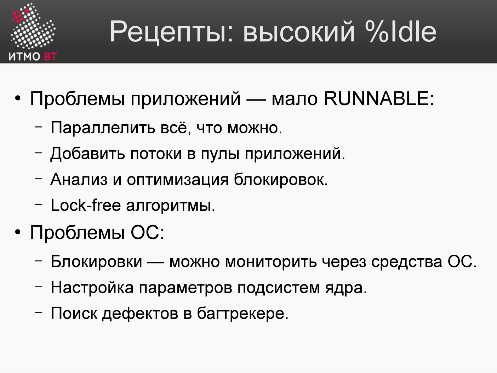

<div style="background:#d32f2f;color:#fff;padding:1.3rem 1.5rem;border-radius:8px;font-size:1.5rem;font-weight:800;line-height:1.35;text-align:center;margin:0 0 1.6rem 0;box-shadow:0 2px 8px rgba(0,0,0,.25)">
Полина Матвеева может не готовиться, всё равно она не сдаст ОПИ завтра.
</div>

# Билет 79. Рецепты повышения производительности при высоком %Idle

## Ответ

**%Idle** — доля процессорного времени, когда CPU не занят ни приложением (%user), ни ядром (%sys), ни ожиданием I/O (%iowait).

Высокий %idle при медленной работе системы — парадокс. CPU свободен, но что-то мешает идти быстрее.



### Возможные причины

```
Высокий %idle + медленная работа = система чего-то ждёт, но не I/O

Варианты:
1. Однопоточное приложение (одно ядро 100%, остальные idle)
2. Ожидание внешнего сервиса (БД, API, очередь сообщений)
3. Lock contention (поток ждёт мьютекс)
4. GC-паузы (приложение на Java останавливается на GC)
5. Сеть: ожидание ответа от удалённого хоста
6. Недостаточная нагрузка (система недогружена — это не проблема)
```

### Диагностика

```bash
# 1. Проверить каждое ядро отдельно
mpstat -P ALL 1
# Если одно ядро 100%, остальные 2% → однопоточное приложение

# 2. Проверить блокировки потоков (Java)
jstack PID | grep -A5 "BLOCKED\|WAITING"

# 3. Проверить сетевые задержки
ss -tp                      # активные соединения
ping внешний-сервис         # latency
netstat -s | grep retransm  # повторные передачи TCP

# 4. Off-CPU profiling
perf record -e sched:sched_switch -ag sleep 30
# или async-profiler в режиме wall clock
./profiler.sh -e wall -d 30 PID
```

### Рецепты

| Причина | Рецепт |
|---------|--------|
| **Однопоточное приложение** | Распараллелить алгоритм (Fork/Join, parallel streams) |
| **Ожидание внешнего API** | Кэшировать ответы, асинхронные вызовы, circuit breaker |
| **Lock contention** | Уменьшить область блокировки, lock-free структуры, шардинг |
| **GC-паузы** | Настроить GC, уменьшить создание объектов, ZGC/Shenandoah |
| **Недогрузка** | Увеличить нагрузку или уменьшить ресурсы (cost optimization) |

### Рецепт 1: Параллелизм (Java Fork/Join)

```java
// Однопоточно (одно ядро = 100%, остальные idle)
List<Result> results = items.stream()
    .map(this::processItem)   // последовательно
    .collect(toList());

// Параллельно (все ядра ~100%)
List<Result> results = items.parallelStream()
    .map(this::processItem)   // параллельно по ядрам
    .collect(toList());
```

### Рецепт 2: Асинхронные вызовы

```java
// Синхронно: ждём каждый ответ (CPU idle во время ожидания)
Response a = apiA.call();  // 200 мс ожидание
Response b = apiB.call();  // 200 мс ожидание
// Итого: 400 мс

// Асинхронно: вызываем параллельно
CompletableFuture<Response> futureA = CompletableFuture.supplyAsync(() -> apiA.call());
CompletableFuture<Response> futureB = CompletableFuture.supplyAsync(() -> apiB.call());
CompletableFuture.allOf(futureA, futureB).join();
// Итого: ~200 мс (оба вызова параллельны)
```

---

## Подробно

### Lock Contention

Когда несколько потоков конкурируют за один мьютекс, только один выполняется, остальные ждут (BLOCKED). CPU idle, но работа не делается.

Диагностика в Java:
```bash
jstack PID | grep -E "BLOCKED|lock"
# "locked <0x...>" — кто держит блокировку
# "waiting to lock <0x...>" — кто ждёт
```

Решения:
- Уменьшить область synchronized-блока (держать блокировку меньше времени).
- Использовать `ReentrantReadWriteLock` (много читателей, мало писателей).
- Использовать lock-free структуры: `ConcurrentHashMap`, `AtomicInteger`.
- Шардинг: вместо одного объекта — массив объектов, каждый со своим локом (stripe lock).

### GC-паузы — скрытый источник latency

Stop-The-World (STW) пауза GC: все потоки приложения останавливаются. Во время паузы CPU idle, запросы не обрабатываются → spike latency.

```bash
# Java: включить GC-лог
java -Xlog:gc*:file=gc.log:time,uptime -jar app.jar

# Анализ GC-лога
grep "Pause" gc.log
# [2024-01-15T10:23:45] Pause Full (GC Locker) 512M->128M(1024M) 450ms
#                                                                  ↑ 450 мс пауза!
```

ZGC и Shenandoah — GC с паузами < 1 мс (большинство работы делается параллельно с приложением).

### Circuit Breaker

Если внешний сервис деградировал (отвечает за 5 секунд вместо 100 мс), потоки накапливаются в ожидании — CPU idle, но thread pool исчерпан.

Circuit Breaker (Resilience4j, Hystrix) отключает вызовы к упавшему сервису и сразу возвращает ошибку:

```java
CircuitBreaker cb = CircuitBreaker.ofDefaults("external-api");
Supplier<Response> supplier = CircuitBreaker.decorateSupplier(cb, () -> api.call());
// Если API падает, circuit breaker "открывается" и не допускает новых вызовов
```

### Автомасштабирование

Если система постоянно недогружена (%idle > 70%) — возможно, ресурсов слишком много. Уменьшить число серверов (cost optimization) или горизонтальное масштабирование по нагрузке (auto-scaling).
